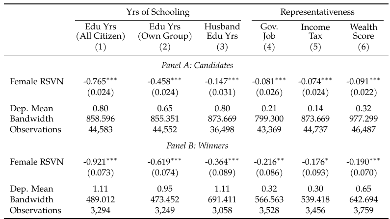
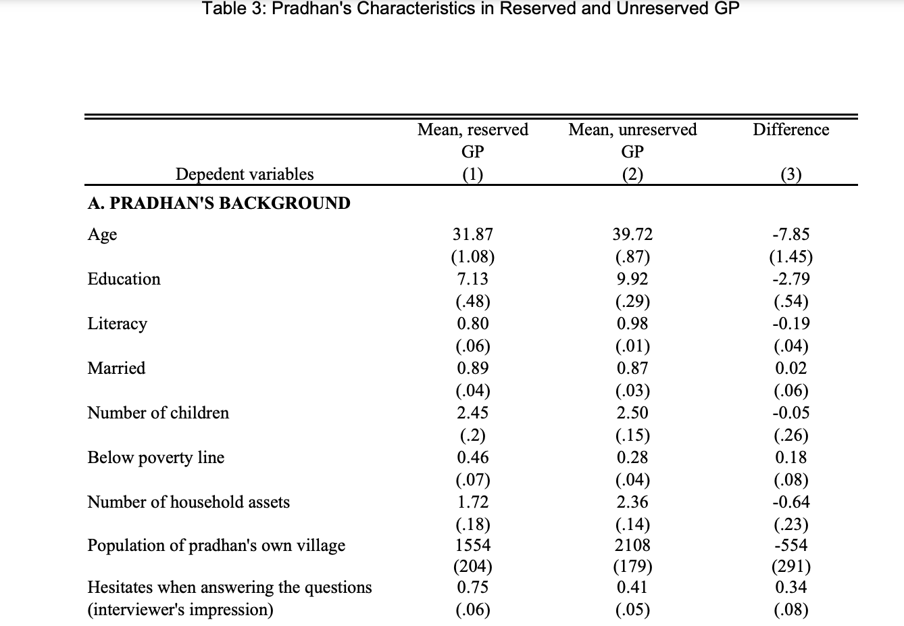
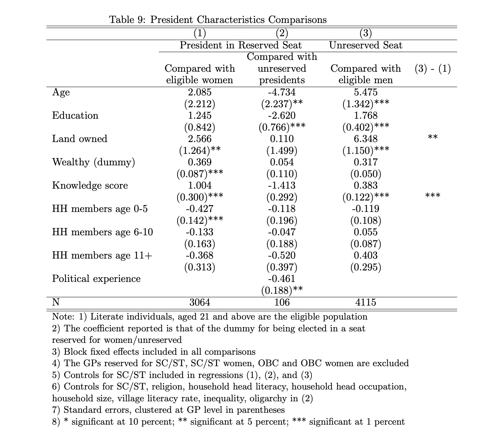
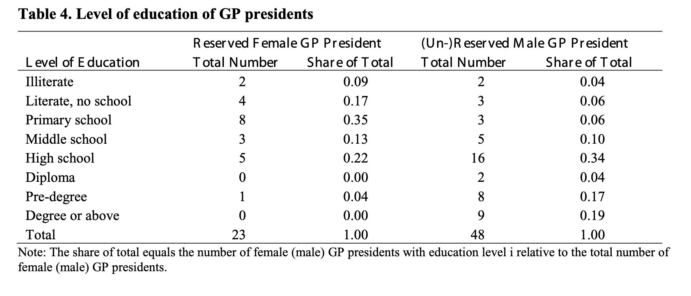
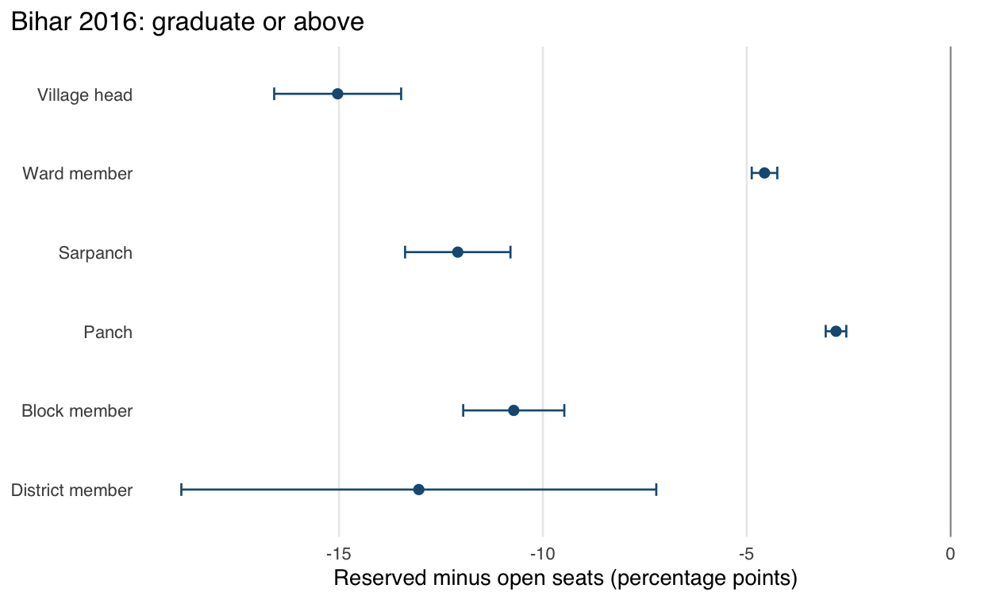

## Effect of Gender Quotas on Some Qualities of Elites

Women's quotas often bring less educated and less politically experienced leaders into India's rural local governments. The evidence includes both early reservation cycles in West Bengal and recent elections in Bihar.[^cd][^beaman][^bamezai] The pattern varies by place: our [Bihar, UP and Rajasthan tables](#results) show education gaps, while [Kerala](#kerala) and [Mumbai](#mumbai-bmc-who-gets-elected-under-the-quota) provide counterexamples. Mumbai's reserved-seat councillors also have fewer pending criminal cases.

These are separate qualities of candidates and elected leaders. Lower education or less experience need not imply worse performance in office: women leaders in Andhra Pradesh initially underperform in programme implementation but catch up during their term.[^afridi] Younger age, household wealth and occupation describe who enters politics; they are not, by themselves, rankings of competence.

### Context

The 73rd Constitutional Amendment requires at least one-third of directly elected Panchayat seats and chairperson positions to be reserved for women. Article 243D provides for rotation; it does not require random assignment. Identifying a causal effect therefore depends on the allocation rule in the state and election being studied. See [Article 243D in the amendment](https://www.legislative.gov.in/static/uploads/2025/07/d6e04624ef8b6b869af003909507cfe6.pdf). The Bihar study below, for example, uses population thresholds rather than a lottery.[^bamezai]

Village councils provide local infrastructure and identify government programme beneficiaries. Council heads exercise substantial influence over these decisions, which is why changes in who holds office may matter. See the [description of the West Bengal study](https://www.povertyactionlab.org/evaluation/influencing-provision-social-services-through-mandated-female-representation).

### Hypotheses About the Effect of Gender Quotas on Quality of Elites

* Political Experience: We expect quotas to bring in candidates with less political experience, at least initially.
* Criminal Record: We expect candidates under quotas to have fewer pending criminal cases.
* Education: Where women have had fewer educational opportunities, we expect quotas to bring in less educated candidates, at least initially.
* Occupation: Where women have had fewer opportunities for paid and professional work, we expect candidates under quotas to be less likely to have those occupations.
* Age: We expect quotas to bring in younger candidates.

Education and criminal charges may matter for performance. Research on national leaders finds higher growth under more educated leaders ([Besley, Montalvo and Reynal-Querol 2011](https://academic.oup.com/ej/article-abstract/121/554/F205/5079434)). In India, the close-election victory of state legislators facing criminal charges reduces household electrification and literacy ([Cheng and Urpelainen 2019](https://link.springer.com/article/10.1007/s12116-019-09290-5)). These studies concern different offices and do not establish the consequences of women's local-election quotas.

### Prior Research

The comparisons below concern seats reserved for women versus seats without a women's reservation, unless otherwise stated. An unreserved seat can elect a woman. Percentages are group averages; differences labelled as adjusted estimates come from regressions. SE means standard error; SD means standard deviation. Schooling, knowledge scores and experience remain separate measures.

| Study and sample | Education | Knowledge, experience and other findings |
|:-----------------|:----------|:----------------------------------------|
| Chattopadhyay and Duflo (2001 working paper; published 2004). West Bengal; 161 council heads.[^cd] | 7.13 versus 9.92 years of schooling; difference **−2.79 years** (SE 0.54). | **11% versus 43%** had been elected to the council before 1998. Means from Table 3, panels A and B. |
| Ban and Rao (2008; figures from the May 2007 draft). Four southern states; 106 presidents in the adjusted comparison.[^ban] | **−2.62 years** (SE 0.77), adjusted estimate. | Political-knowledge score **−1.41 points** (SE 0.29), with less political experience. Table 9 excludes caste-reserved councils; it is not restricted to SC/ST seats. |
| Raabe, Sekher and Birner (2009). Karnataka; 23 reserved female presidents and 48 male presidents in Table 4.[^raabe] | **0% versus 19%** have a degree or above; **9% versus 4%** are illiterate. | Descriptive comparison of reserved female presidents with male presidents in seats with or without caste reservation. The sample includes several caste groups (Table 3). |
| Beaman et al. (2009). Birbhum, West Bengal; leaders in the 2003 council term.[^beaman] | **−2.10 years** (SE 0.55), adjusted for block effects. | **26.5 percentage points more likely** to be a first-time pradhan (SE 6.8). Table II, column 6 compares currently reserved and unreserved councils. |
| Deininger et al. (2015; figures from the 2011 working paper). NCAER survey of 233 villages, with up to three election rounds.[^deininger] | **24.72% versus 5.74%** illiterate; **28.65% versus 62.69%** have at least secondary education. | **11.67% versus 24.24%** previously held political office. Table 3 reports descriptive comparisons, with 180 reserved and 459 unreserved observations. |
| Afridi, Iversen and Sharan (2017; characteristics from the 2013 working paper). Andhra Pradesh; 297 surveyed council heads with characteristics available.[^afridi] | **15% versus 54%** have higher-secondary education or more; **9% versus 0%** are illiterate. | **11% versus 22%** have prior political experience. Table 2 reports means for 128 reserved and 169 unreserved heads. |
| Mori et al. (2025; distributions and sample from the September 2022 draft). Karnataka's 2020 council election; 218 candidates in 97 constituencies.[^mori] | The draft's Figure 2 shows lower educational attainment among candidates in women-reserved constituencies. | The draft reports lower average cognitive and non-cognitive skills among female candidates. Its Figure 2 and Table 3 examine the distributions and selection; no numerical effect from the final article is reported here. |
| Bamezai et al. (March 2026 working paper). Bihar's 2016 and 2021 elections; reservation effects estimated around population thresholds.[^bamezai] | Standardized schooling: **−0.765 SD for candidates** (SE 0.024; N=44,583) and **−0.921 SD for winners** (SE 0.073; N=3,294). | Replacing the woman's schooling with her husband's still gives negative estimates: **−0.147 SD for candidates** (SE 0.031) and **−0.364 SD for winners** (SE 0.089). Table 7; these are education measures, not direct tests of who governs. |

Bamezai et al. (2026), [Table 7, excerpt](https://www.mrsharan.com/papers/political-selection.pdf#page=44). Columns 1–3 measure standardized schooling; column 3 substitutes the husband's schooling.[^bamezai]

Some papers reach favorable judgments on other questions. Mori et al. find stronger cognitive selection of women relative to the eligible female population.[^mori] That comparison does not establish higher absolute qualifications under quotas. Beaman et al. find improved attitudes toward women leaders and subsequent electoral gains for women.[^beaman] Deininger et al. find gains in women's political participation and accountability despite lower leader qualifications.[^deininger]

Caveat: Lower qualifications do not establish lower net output. Ban and Rao find no overall performance difference between female and male leaders.[^ban] Afridi et al.'s published article finds initial implementation disadvantages followed by full catch-up during the term, with no evidence of overtaking. That is the published conclusion; its earlier working paper is used above only for the characteristics table.[^afridi]

The studies are not eight independent national tests. Samples, offices and reservation rules differ; the two West Bengal studies revisit Birbhum in different election cycles.[^cd][^beaman] The March 2026 Bihar draft is unpublished, and some prose estimates differ slightly from Table 7; the numbers above follow that table.[^bamezai] External studies are summarized from their papers, not replicated here.

Earlier studies: original table excerpts

Chattopadhyay and Duflo, Table 3.[^cd]

Ban and Rao, Tables 8 and 9.[^ban]

Raabe, Sekher and Birner, Table 4.[^raabe]

### Results

#### Bihar 2016: elected officials

Women-reserved seats elect fewer graduates in all six offices. With block and caste-reservation controls, the graduate-share gap is **−15.0 percentage points for mukhiyas** and **−12.1 points for sarpanches**. Winners are also younger, and illiteracy is higher in five offices with confidence intervals excluding zero. Zila parishad's illiteracy estimate is less precise.

| Elected office | Graduate+ (pp) | Illiterate (pp) | Age (years) | N, education |
|:---------------|---------------:|----------------:|------------:|-------------:|
| Mukhiya | −15.0 (0.8) | +1.5 (0.3) | −3.6 (0.2) | 7,908 |
| Sarpanch | −12.1 (0.7) | +4.6 (0.5) | −5.7 (0.3) | 7,864 |
| Ward member | −4.6 (0.2) | +11.6 (0.4) | −2.0 (0.1) | 97,278 |
| Panch | −2.8 (0.1) | +14.8 (0.4) | −2.9 (0.1) | 85,385 |
| Panchayat samiti member | −10.7 (0.6) | +3.2 (0.4) | −2.7 (0.2) | 10,769 |
| Zila parishad member | −13.0 (2.9) | +1.6 (0.9) | −4.1 (0.7) | 889 |

Entries are adjusted differences between seats reserved for women and seats open to either sex; clustered SEs are in parentheses. Each office has its own regression with block and caste-reservation fixed effects. Zila parishad uses district effects because block is unavailable. SEs are clustered at the geographic-control level. A causal interpretation requires reservation to be unrelated to unobserved determinants of qualifications after these controls.

Source: [Bihar SEC records preserved in local_elections_bihar](https://github.com/in-rolls/local_elections_bihar), standardized by [local_elections](https://github.com/in-rolls/local_reservations/blob/8bf094df8a621123eddec2af533a8e134577bc89/src/local_reservations/common/adapters/bihar.py). [Analysis](scripts/bihar_winners.R), [estimates and confidence intervals](output/bihar_2016/regressions.csv), [group means](output/bihar_2016/descriptive.csv), and [sample accounting](output/bihar_2016/sample_flow.csv).

The analysis identifies 210,955 winners from unique highest recorded votes or a sole uncontested candidacy, then excludes 45 seats with ambiguous candidate serials. Unknown education is missing, not non-graduate or literate. Age is restricted to 21–100 without dropping those records from the education analysis. Vacancies and unresolved contests supply no winner. The [analysis data](output/bihar_2016/winners.parquet) contain 210,910 seats; outcome-specific sample sizes and input hashes are recorded in the outputs.

Reproduce from the sibling `local_elections` checkout with `Rscript scripts/bihar_winners.R`, then run `Rscript tests/test_bihar_winners.R`. Required R packages are `arrow`, `dplyr`, `readr`, `fixest`, `ggplot2`, `digest`, `jsonlite` and `testthat`. Set `BIHAR_MASTER` to use another input directory. Tests compare the mukhiya estimate and clustered variance with explicit OLS and independently summed cluster scores.

The [Bihar data repository](https://github.com/in-rolls/local_elections_bihar#2021-and-the-current-portal) now also contains an explicitly dated 2021 Arwal pilot and a statewide mukhiya index with 8,066 affidavit links. Education and prior office appear in handwritten candidate biographies, including [this 2021 source document, p. 14](https://sec2021.bihar.gov.in/ForPublicPDF_P/Documents1n2/NominationDoc/20210913143841096.pdf#page=14). Extraction is pending; no 2021 qualification estimate is reported here.

#### Descriptive comparisons

These are our own tabulations by seat category. Tables 1-5 are descriptive: their differences alone do not identify quota effects. Education thresholds differ across datasets, so the levels should not be pooled. Shares are proportions (0.15 = 15%); age is in years. N is the number of records in each group, and the number with a reported outcome may be smaller. A category labelled "Unreserved (Women)" is reserved for women but has no caste reservation.

**Table 1: Bihar 2016 Sarpanch Candidates by Reservation Status**

Source: [Bihar candidate data](https://github.com/in-rolls/bihar_2016_panchayat_elex/blob/master/data/sarpanch.csv), analyzed in [scripts/bihar.R](scripts/bihar.R). The script keeps candidates with a reported age below 100. Sarpanch is the office recorded in this dataset; the Bamezai et al. study above concerns mukhiya candidates.

|Reservation Status (Hindi) | Reservation Status (English) | Illiterate | Graduate+ | Mean Age | N |
|:--------------------------|:-----------------------------|----------:|---------:|---------:|-----:|
|अनारक्षित | Unreserved | 0.02 | 0.15 | 46.86 | 17,345|
|अनारक्षित(महिला) | Unreserved (Women) | 0.08 | 0.04 | 41.35 | 13,776|
|अनुसूचित जनजाति | Scheduled Tribe (ST) | 0.01 | 0.05 | 44.53 | 293|
|अनुसूचित जनजाति(महिला) | ST (Women) | 0.05 | 0.02 | 38.03 | 62|
|अनुसूचित जाति | Scheduled Caste (SC) | 0.05 | 0.09 | 44.78 | 3,976|
|अनुसूचित जाति(महिला) | SC (Women) | 0.11 | 0.02 | 39.31 | 2,243|
|पिछड़ा वर्ग | Backward Class (OBC) | 0.03 | 0.09 | 46.19 | 4,654|
|पिछड़ा वर्ग(महिला) | OBC (Women) | 0.10 | 0.02 | 40.44 | 2,683|

**Table 2: Uttar Pradesh 2015 Candidates by Reservation Status**

Source: [scripts/up.R](scripts/up.R), reading `data/up_2015/`. This table pools the offices in those files; it is not restricted to village-council heads.

|Reservation Status (Hindi) | Reservation Status (English) | Illiterate | College+ | N |
|:--------------------------|:-----------------------------|----------:|---------:|-----:|
|अनारक्षित | Unreserved | 0.08 | 0.26 | 73,410|
|अनुसूचित जनजाति | Scheduled Tribe (ST) | 0.10 | 0.19 | 620|
|अनुसूचित जनजाति महिला | ST Women | 0.26 | 0.23 | 699|
|अनुसूचित जाति | Scheduled Caste (SC) | 0.16 | 0.15 | 26,875|
|अनुसूचित जाति महिला | SC Women | 0.32 | 0.09 | 17,513|
|अन्य पिछड़ा वर्ग | Other Backward Class (OBC) | 0.11 | 0.20 | 34,504|
|अन्य पिछड़ा वर्ग महिला | OBC Women | 0.25 | 0.12 | 20,819|
|महिला | Women | 0.21 | 0.15 | 32,193|

**Table 3: Uttar Pradesh 2021 Gram Panchayat Pradhan Candidates by Reservation Status**

Source: [scripts/up.R](scripts/up.R), reading `up_gram_panchayat_pradhan_2021.csv.zip`. The 2015 and 2021 tables cover different office samples.

|Reservation Status (Hindi) | Reservation Status (English) | Illiterate | College+ | N |
|:--------------------------|:-----------------------------|----------:|---------:|------:|
|अनारक्षित | Unreserved | 0.09 | 0.17 | 126,028|
|अनुसूचित जनजाति | Scheduled Tribe (ST) | 0.11 | 0.10 | 1,034|
|अनुसूचित जनजाति महिला | ST Women | 0.21 | 0.07 | 678|
|अनुसूचित जाति | Scheduled Caste (SC) | 0.13 | 0.12 | 55,808|
|अनुसूचित जाति महिला | SC Women | 0.24 | 0.07 | 29,993|
|अन्य पिछड़ा वर्ग | Other Backward Class (OBC) | 0.10 | 0.15 | 64,610|
|अन्य पिछड़ा वर्ग महिला | OBC Women | 0.21 | 0.09 | 32,028|
|महिला | Women | 0.17 | 0.11 | 62,917|

**Table 4: Rajasthan 2019 Municipal Winners by Ward Category**

Source: [scripts/rajasthan.R](scripts/rajasthan.R), joining `rajasthan_municipal_2019.csv` and `rajasthan_municipal_2019_education_winning.csv`. Education is for elected members; the low-education category includes 12th standard.

|Ward Category | Reservation Status (English) | HS or Less | Mean Age | N |
|:-------------|:----------------------------|----------:|---------:|---:|
|gen women | General Women | 0.73 | 41 | 396|
|general | General | 0.64 | 42 | 870|
|obc | Other Backward Class (OBC) | 0.67 | 42 | 287|
|obc women | OBC Women | 0.77 | 41 | 148|
|sc | Scheduled Caste (SC) | 0.67 | 40 | 203|
|sc women | SC Women | 0.80 | 35 | 104|
|st | Scheduled Tribe (ST) | 0.68 | 39 | 50|
|st women | ST Women | 0.86 | 37 | 21|
|women | Women | 0.81 | 43 | 26|

### Kerala

Kerala provides a counterexample, especially in Grama Panchayats: the reported bachelor's and master's shares are the same for General and Woman seats after rounding. Corporation representatives in Woman seats have higher shares in both degree categories. Other comparisons vary, and some ST groups are very small (Table 5).

**Table 5: Kerala Local-Government Records by Body and Reservation**

Source: [scripts/kerala.R](scripts/kerala.R), reading `data/lsgi-election-kerala.csv` and pooling years. Unmatched and unknown education strings enter "Other". The UP, Rajasthan and Kerala input files are not included in this repository; their original collection details and these tabulations need verification before reuse.

|Local body     |Reservation | HS or below| Bachelor's| Master's or above| Other/unknown| N|
|:---------------|:-----------|-----------:|--------------:|---------------------:|----------:|-----:|
|Block           |General     |        0.60|           0.22|                  0.05|       0.13|  2478|
|Block           |Woman       |        0.66|           0.18|                  0.04|       0.12|  2988|
|Block           |SC          |        0.71|           0.09|                  0.03|       0.16|   446|
|Block           |SC Woman    |        0.74|           0.12|                  0.02|       0.12|   214|
|Block           |ST          |        0.78|           0.03|                  0.02|       0.17|    60|
|Block           |ST Woman    |        0.91|           0.03|                  0.03|       0.03|    32|
|Corporation     |General     |        0.59|           0.21|                  0.04|       0.16|   556|
|Corporation     |Woman       |        0.47|           0.30|                  0.08|       0.15|   551|
|Corporation     |SC          |        0.66|           0.17|                  0.00|       0.17|    35|
|Corporation     |SC Woman    |        0.60|           0.14|                  0.07|       0.19|    43|
|District        |General     |        0.36|           0.40|                  0.07|       0.17|   429|
|District        |Woman       |        0.44|           0.36|                  0.07|       0.13|   449|
|District        |SC          |        0.57|           0.27|                  0.00|       0.16|    51|
|District        |SC Woman    |        0.38|           0.38|                  0.15|       0.10|    48|
|District        |ST          |        0.67|           0.25|                  0.00|       0.08|    12|
|District        |ST Woman    |        1.00|           0.00|                  0.00|       0.00|     4|
|Grama Panchayat |General     |        0.69|           0.12|                  0.03|       0.15| 20149|
|Grama Panchayat |Woman       |        0.72|           0.12|                  0.03|       0.13| 22456|
|Grama Panchayat |SC          |        0.77|           0.07|                  0.02|       0.14|  2924|
|Grama Panchayat |SC Woman    |        0.76|           0.09|                  0.02|       0.13|  2250|
|Grama Panchayat |ST          |        0.79|           0.03|                  0.01|       0.18|   425|
|Grama Panchayat |ST Woman    |        0.81|           0.02|                  0.00|       0.17|   310|
|Municipality    |General     |        0.68|           0.16|                  0.05|       0.11|  3840|
|Municipality    |Woman       |        0.68|           0.17|                  0.04|       0.10|  3908|
|Municipality    |SC          |        0.79|           0.09|                  0.03|       0.09|   297|
|Municipality    |SC Woman    |        0.70|           0.14|                  0.05|       0.12|   307|
|Municipality    |ST          |        0.83|           0.06|                  0.00|       0.11|    18|
|Municipality    |ST Woman    |        0.81|           0.00|                  0.00|       0.19|    16|

## Mumbai (BMC): who gets elected under the quota

The Mumbai data record 76 of 227 wards reserved for women in the 2007 council and 114 from 2012. Affidavit fields give education, age and pending criminal cases for the 2012 and 2017 councils. The Praja/affidavit table is held in [local_reservations](https://github.com/in-rolls/local_reservations), at `data/maharashtra/mumbai/praja_ward_ratings_2011_2018.csv`, mirrored from the [Karekurve-Ramachandra and Lee replication deposit](https://doi.org/10.7910/DVN/IO9SLQ). [scripts/mumbai.R](scripts/mumbai.R) checks the input's SHA-256 and reservation counts, then writes [the summary](output/mumbai/tab_quality.md) and [regression results](output/mumbai/tab_quality_reg.md). Its default input path uses the sibling directory `../local_elections/`; `MUMBAI_RATINGS` can specify another path.

The analysis keeps one observation per councillor spell with age recorded. The 2017 table contains 222 councillors, compared with 227 in 2012. Pending cases are allegations, not convictions. "HS or less" here ends at 10th standard; Rajasthan's category includes 12th standard.

Table 6: Mumbai councillors by seat type and council

| council|seat               |   n| share female| share HS or less| share graduate+| mean age| share any criminal case| mean criminal cases|
|-------:|:------------------|---:|------------:|----------------:|---------------:|--------:|-----------------------:|-------------------:|
|    2012|Open               | 113|        0.062|            0.407|           0.248|   45.956|                   0.327|               0.929|
|    2012|Reserved for women | 114|        1.000|            0.447|           0.351|   42.728|                   0.035|               0.070|
|    2017|Open               | 110|        0.164|            0.445|           0.364|   47.791|                   0.273|               0.382|
|    2017|Reserved for women | 112|        1.000|            0.312|           0.438|   45.518|                   0.036|               0.071|

With administrative-ward and council fixed effects, reserved-seat councillors are 2.6 years younger (SE 0.9) and 26.8 percentage points less likely to have a pending criminal case (SE 3.6). The graduate-or-above share is 8.4 percentage points higher (SE 4.5, p = 0.062), providing no evidence of the education decline seen in Bihar and UP. Standard errors are clustered by ward. See [regression results](output/mumbai/tab_quality_reg.md) and [the analysis](scripts/mumbai.R).

Whether these councillors are rated better by residents is the question of [quota_unquote](https://github.com/in-rolls/quota_unquote), which uses the same data with the lottery as identification.

[^cd]: Raghabendra Chattopadhyay and Esther Duflo. *Women as Policy Makers: Evidence from a India-Wide Randomized Policy Experiment*. [NBER Working Paper 8615, December 2001, Table 3](https://www.nber.org/system/files/working_papers/w8615/w8615.pdf). Published as *Women as Policy Makers: Evidence from a Randomized Policy Experiment in India*, Econometrica 72(5), 2004, pp. 1409-1443. The figures here are from the 2001 West Bengal sample.

[^ban]: Radu Ban and Vijayendra Rao. *Tokenism or Agency? The Impact of Women's Reservations on Village Democracies in South India*. Economic Development and Cultural Change 56(3), 2008, pp. 501-530. Figures and sample restrictions here follow [Tables 8 and 9 of the May 2007 draft](https://vijayendrarao.org/papers/EDCC_Reservations_to_go.pdf).

[^raabe]: Katharina Raabe, Madhushree Sekher and Regina Birner. *The Effects of Political Reservations for Women on Local Governance and Rural Service Provision: Survey Evidence from Karnataka*. [IFPRI Discussion Paper 00878, 2009, Tables 3 and 4](https://cgspace.cgiar.org/server/api/core/bitstreams/c85053d0-fd33-400a-b7bb-05a04874175f/content).

[^beaman]: Lori Beaman, Raghabendra Chattopadhyay, Esther Duflo, Rohini Pande and Petia Topalova. *Powerful Women: Does Exposure Reduce Bias?* Quarterly Journal of Economics 124(4), 2009, pp. 1497-1540. [Published paper, Table II, p. 1507](https://www.povertyactionlab.org/sites/default/files/research-paper/310%20Female%20Quotas%20Nov%2009.pdf).

[^deininger]: Klaus Deininger, Songqing Jin, Hari K. Nagarajan and Fang Xia. *Does Female Reservation Affect Long-Term Political Outcomes? Evidence from Rural India*. [Journal of Development Studies 51(1), 2015, pp. 32-49](https://doi.org/10.1080/00220388.2014.947279). Characteristics and sample counts here follow [World Bank Working Paper 5708, June 2011, Table 3, p. 22](https://documents1.worldbank.org/curated/en/595231468040603055/pdf/WPS5708.pdf).

[^afridi]: Farzana Afridi, Vegard Iversen and M. R. Sharan. *Women Political Leaders, Corruption, and Learning: Evidence from a Large Public Program in India*. [Economic Development and Cultural Change 66(1), 2017, pp. 1-30](https://doi.org/10.1086/693679). Leader characteristics follow [IZA Discussion Paper 7212, February 2013, Table 2, p. 38](https://docs.iza.org/dp7212.pdf); the catch-up conclusion follows the published article.

[^mori]: Yuko Mori, R. Manjula, D. Rajasekhar, Jun Goto and Takashi Kurosaki. *Who Becomes a Politician in a Gender Quota System? Evidence from India*. [World Development 188, 2025, article 106911](https://doi.org/10.1016/j.worlddev.2024.106911). The published article reports stronger cognitive selection relative to same-gender voters. The sample description and absolute qualification comparisons here follow the [September 15, 2022 draft, Section 2.2, Figure 2 and Table 3](https://www.isid.ac.in/~epu/acegd2022/papers/Yuko_Mori.pdf).

[^bamezai]: Apurva Bamezai, Siddharth George, M. R. Sharan and Borui Sun. *The Determinants and Consequences of Political Selection in the Developing World: Evidence from India*. [Working paper, March 26, 2026, Section 7.2 and Table 7, p. 44](https://www.mrsharan.com/papers/political-selection.pdf). The education measures are standardized against citizen distributions. The table's candidate and winner counts are estimation samples, not the full linked census or candidate roster.
