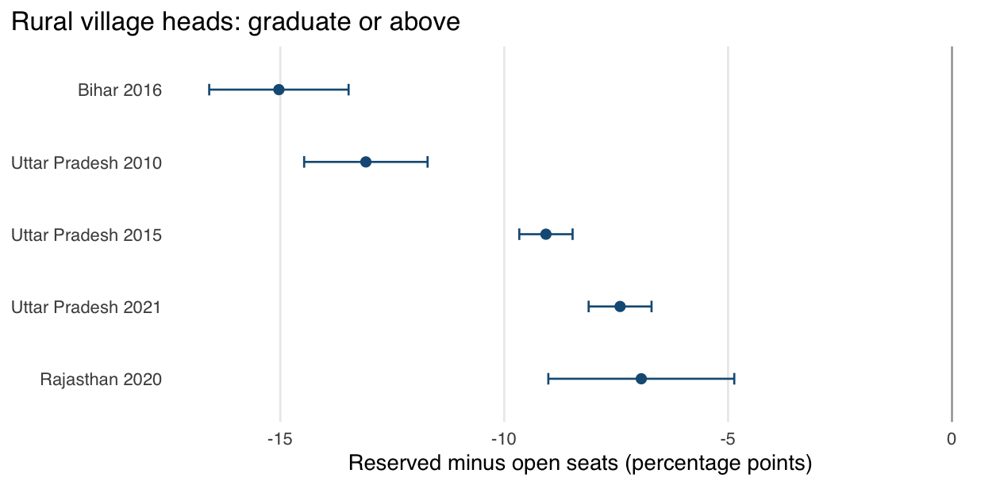
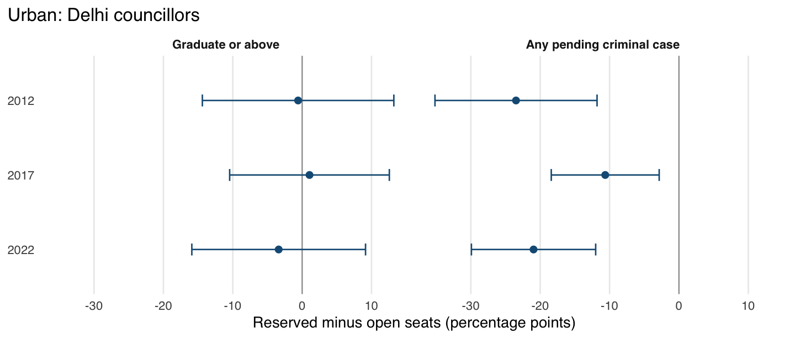

# Female reservation and the quality of elected elites

How does reserving an office for women change the qualifications of the person elected? We analyze **rural panchayats and urban councils separately**, by state, election and office.

**[Read the manuscript](manuscript/main.pdf)** · [Editable source](manuscript/main.Rmd) · [Original paper excerpts](evidence/) · [Source links and table locations](evidence/sources.csv) · [Input hashes](evidence/analysis_inputs.csv)

## Rural panchayats

Bihar and UP show lower graduate shares among elected village heads. Rajasthan has a negative estimate among classified winners, but extensive missing education prevents an all-winner conclusion. Kerala's ward-member estimates are much closer to zero. The regressions control for caste reservation and district or block; a causal interpretation requires conditional comparability of reserved and open seats. Unclassified education stays missing. [Estimates, intervals and sample sizes](output/rural_estimates.csv).



[Missing-education bounds](output/missing_education_bounds.csv) · [Kerala by election and office](output/kerala/education.png) · [Bihar's six offices](output/bihar_2016/education.png)

## Urban councils

Mumbai's reserved-seat councillors have fewer pending criminal cases and a higher estimated graduate share, although the education interval includes zero. Cases are allegations, not convictions. [Estimates and intervals](output/mumbai/regressions.csv).

[Mumbai figure](output/mumbai/quality.png)

Delhi adds the 2012, 2017 and 2022 elections. Graduate-share intervals include zero in each; reserved-seat winners have fewer recorded pending cases in all three. The regressions control for assembly constituency and caste reservation, with clustering by assembly constituency. [Estimates](output/delhi/regressions.csv) · [Coverage](output/delhi/descriptive.csv) · [Missing-record bounds](output/delhi/missing_outcome_bounds.csv).



Delhi qualifications now come from [individual MyNeta profiles](output/delhi/source_links.csv), after source checks exposed conflicting education entries in the older files. Winner rosters and geography come from [Goyal’s deposit](https://doi.org/10.7910/DVN/9XPV4I), [2022 results](https://data.opencity.in/dataset/delhi-mcd-elections-2022) and the [SEC gazette](https://sec.delhi.gov.in/sites/default/files/SEC/generic_multiple_files/reservationorder_0.pdf). Missing profiles stay missing; conviction tables are excluded from pending cases. [Upstream data and parser](https://github.com/in-rolls/local_reservations/tree/d806f279f5ddba4952580e1ea63d90c11cda573e/data/delhi). [Source audit](output/delhi/source_comparison.csv) · [SEC source excerpt](evidence/delhi_2022_reservation_annexure_b.png) · [ADR education table](evidence/delhi_2022_adr_education.png).

The manuscript opens with an abstract, evidence on why education, experience, criminal cases, age and economic resources may matter for governing, and existing reservation studies. It distinguishes causal findings from associations and includes contrary evidence on education. Graduate share is the common education outcome; the appendix reports illiteracy as another part of the same education distribution. Each citation identifies the version and source table. [Historical descriptive tables](evidence/legacy_readme_tables.json) preserve the earlier README's candidate and municipal tabulations.

## Reproduce

R packages are pinned in `renv.lock`. The paper also requires Pandoc and XeLaTeX.

```sh
make restore
make check
```

`make check` verifies input hashes, rebuilds the analyses, figures and manuscript, then runs linting and tests. `make format` formats R code. The default inputs are in the sibling `../local_elections` checkout, whose GitHub repository is [local_reservations](https://github.com/in-rolls/local_reservations). State repositories own collection and parsing; the central repository standardizes the data; this repository estimates reservation effects.

[Analysis samples](output/) are saved as Parquet, with CSV estimates, education-label dictionaries and sample accounting. [Data inventory](evidence/data_inventory.csv) distinguishes unused data from analyses already run; [winner-field counts](output/inventory/pooled_winner_fields.csv) document coverage. Some UP inputs reflect integration changes rather than a finalized central release; exact hashes and the [adapter diff](evidence/central_adapters.patch) record that state.

CI runs numerical tests against the saved analysis samples and recompiles the paper with `make lint test manuscript`; rebuilding from central inputs requires `make check`.

The older `bihar.R`, `up.R`, `rajasthan.R` and `kerala.R` scripts reproduce historical descriptive specifications where their inputs are available. They are outside the manuscript build. `up.R` requires the original 2015 candidate directory through `UP_2015_CANDIDATES`; it must not be replaced with the 2015 winner file. Bihar 2021 affidavit extraction remains stopped.
