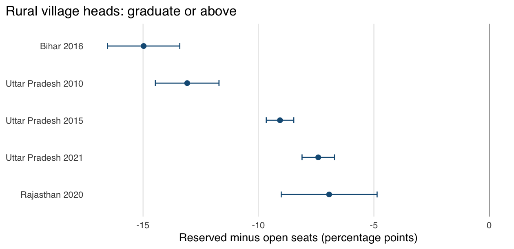
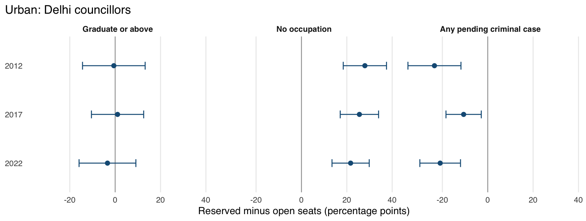

# Female reservation and the quality of elected elites

How does reserving an office for women change the qualifications of the person elected? We analyze **rural panchayats and urban councils separately**, by state, election and office.

**[Read the manuscript](manuscript/main.pdf)** · [Editable source](manuscript/main.Rmd) · [Evidence guide](evidence/) · [Original paper excerpts](evidence/excerpts/) · [Source links and table locations](evidence/sources.csv) · [Input hashes](evidence/analysis_inputs.csv)

## Rural panchayats

Bihar and UP show lower graduate shares among elected village heads. Rajasthan has a negative estimate among classified winners, but extensive missing education prevents an all-winner conclusion. Kerala's ward-member estimates are much closer to zero. The regressions control for caste reservation and district or block; a causal interpretation requires conditional comparability of reserved and open seats. Unclassified education stays missing. [Estimates, intervals and sample sizes](manuscript/main.pdf).



[Missing-education bounds](manuscript/main.pdf) · [Kerala by election and office](figs/kerala_education.png) · [Bihar's six offices](figs/bihar_2016_education.png)

## Urban councils

Mumbai's reserved-seat councillors have fewer pending criminal cases and a higher estimated graduate share, although the education interval includes zero. Cases are allegations, not convictions. [Estimates and intervals](manuscript/main.pdf).

[Mumbai figure](figs/mumbai_quality.png)

Delhi adds the 2012, 2017 and 2022 elections. Graduate-share intervals include zero in each; reserved-seat winners have fewer recorded pending cases in all three. The regressions control for assembly constituency and caste reservation, with clustering by assembly constituency. [Estimates, coverage, and missing-record bounds](manuscript/main.pdf).



Delhi qualifications now come from individual MyNeta profiles, after source checks exposed conflicting education entries in the older files. Winner rosters and geography come from [Goyal’s deposit](https://doi.org/10.7910/DVN/9XPV4I), [2022 results](https://data.opencity.in/dataset/delhi-mcd-elections-2022) and the [SEC gazette](https://sec.delhi.gov.in/sites/default/files/SEC/generic_multiple_files/reservationorder_0.pdf). Missing profiles stay missing; conviction tables are excluded from pending cases. [Upstream data and parser](https://github.com/in-rolls/local_elections/tree/d806f279f5ddba4952580e1ea63d90c11cda573e/data/delhi). [Source comparison code](R/urban.R) · [SEC source excerpt](evidence/excerpts/delhi_2022_reservation_annexure_b.png) · [ADR education table](evidence/excerpts/delhi_2022_adr_education.png).

The manuscript opens with an abstract, evidence on why education, experience, criminal cases, age and economic resources may matter for governing, and existing reservation studies. It distinguishes causal findings from associations and includes contrary evidence on education. Graduate share is the common education outcome; the appendix reports illiteracy as another part of the same education distribution. Each citation identifies the version and source table.

## Occupation, assets and the literature

Reserved-seat winners are far more likely to report no occupation in Rajasthan, Kerala and Delhi, including where their education matches open-seat winners', and declare fewer assets in Rajasthan and Uttar Pradesh. [Estimates](manuscript/main.pdf) · [occupation coding](R/analysis.R).

Published reserved-vs-open schooling comparisons among village heads pool to a standardized difference of about −0.9 across five independent samples; this paper's graduate-share gaps pool by setting. [Forest plots](figs/) · [study files](evidence/literature/studies/).

[Deposit audit](evidence/deposit_audit.md): the Delhi 2012 education in Karekurve-Ramachandra and Lee's AJPS deposit agrees with winners' MyNeta profiles no better than chance; their Mumbai deposit agrees.

## Reproduce

R packages are pinned in `renv.lock`. The paper also requires Pandoc and XeLaTeX.

```sh
make restore
make check
```

`make check` runs lint, verifies upstream input hashes, computes the analyses in memory, runs regression checks, and builds the figures and manuscript. `make paper` rebuilds the paper; `make test` recomputes the analysis and runs the tests. `make format` formats R code.

The [tests](tests/) check missing-value coding, unique winner samples, reservation labels, explicit OLS against the fitted coefficients, manually calculated clustered standard errors, missing-outcome bounds, and literature pooling without duplicate samples. They also check office labels and manuscript summaries. Assertions about effect signs flag prose that needs review when results change; they do not validate causal assumptions.

The build starts in [build.R](build.R). The analysis code has five parts:

- [R/analysis.R](R/analysis.R): input verification, shared occupation coding, and the analysis runner.
- [R/rural.R](R/rural.R): Bihar, Uttar Pradesh, Rajasthan, and Kerala preparation, estimates, and missing-education bounds.
- [R/urban.R](R/urban.R): Mumbai and Delhi preparation, estimates, and source comparisons.
- [R/literature.R](R/literature.R): study extraction and meta-analysis.
- [R/paper.R](R/paper.R): manuscript values, formatted tables, and figures.

The default inputs are in the sibling `../local_elections` checkout ([in-rolls/local_elections](https://github.com/in-rolls/local_elections)). Set `LOCAL_ELECTIONS_MASTER` to use a different verified master directory. Exact hashes and state source revisions are recorded in [the input manifest](evidence/analysis_inputs.csv). State repositories own collection, parsing and cross-year linkage; the central repository standardizes election events; this repository estimates reservation effects.

Preparation, estimation, missing-data bounds, plots, tests, and manuscript tables share R objects in one build process. Tables use `knitr::kable()` directly; the literature appendix has a formatted LaTeX include in [tabs](tabs/). The build saves [figures](figs/) and [the manuscript](manuscript/main.pdf). It does not save prepared datasets, result CSVs, or session logs.

To inspect results without writing files:

```r
source("R/analysis.R")
report <- run_analysis()
knitr::kable(report$rural)
```

The deposit comparison reads the replication data from the upstream checkout and the Mumbai 2012 winners page from MyNeta. The parsed MyNeta table is checked against its recorded hash; it is not saved locally. An internet connection is required for that source check. [Source comparison](evidence/deposit_audit.md).

[Data inventory](evidence/data_inventory.csv) records coverage and analyses not undertaken. The [adapter diff](evidence/central_adapters.patch) documents the earlier UP integration. Superseded descriptive analyses remain in Git history.

There is no hosted CI because the inputs live outside this repository. Local checks require the upstream inputs; missing or changed inputs fail explicitly. Bihar 2021 affidavit extraction remains stopped.
