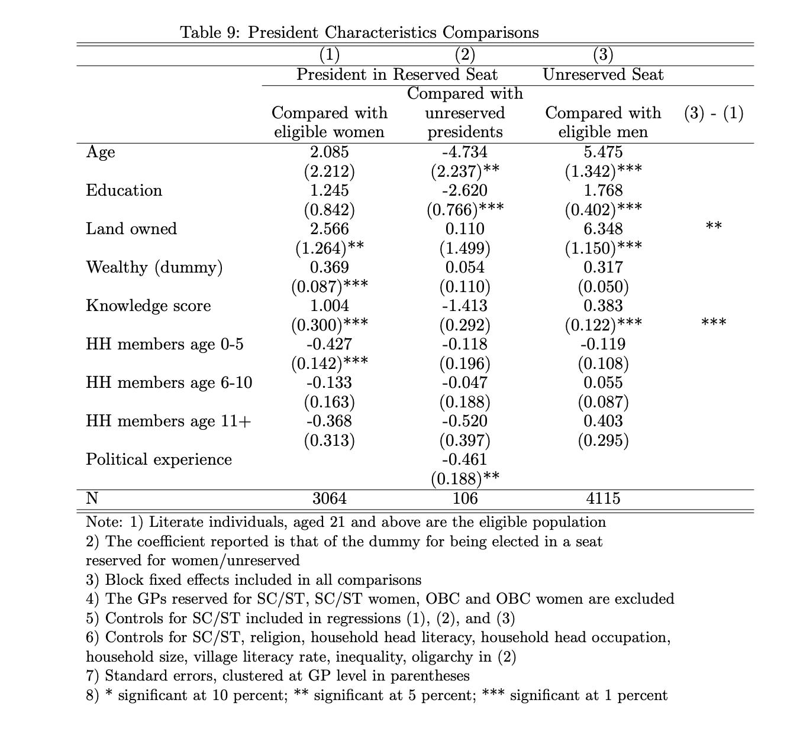

## Effect of Gender Quotas on Some Qualities of Elites

### Context

"In 1993, a constitutional amendment was passed in India that called for a random* one-third of [the] village council leader, or sarpanch, positions in gram panchayat, to be reserved for women. The village council, which encompasses between five and fifteen villages, is responsible for the provision of local infrastructure - such as public buildings, water, and roads - and for identifying government program beneficiaries. Although all decisions in the village council are made by majority, the pradhan is the only full-time member and exercises significant control over the final council decisions. The village council is required to organize two village meetings per year, during which they present their proposed budget and report on their activities in the previous six months. The pradhan must also set up regular office hours where villagers can lodge complaints or requests."

via https://www.povertyactionlab.org/evaluation/influencing-provision-social-services-through-mandated-female-representation

*there is no mention of random. In fact, there is a separate callout that these seats can be allocated by rotation: "Not less than one-third (including the number of seats reserved for women belonging to the Scheduled Castes and the Scheduled Tribes) of the total number of seats to be filled by direct election in every Panchayat shall be reserved for women and such seats may be allotted by rotation to different constituencies in a Panchayat."

https://www.india.gov.in/my-government/constitution-india/amendments/constitution-india-seventy-third-amendment-act-1992

### Hypotheses About the Effect of Gender Quotas on Quality of Elites

* Political Experience: Gender quotas in local electoral bodies are at least initially likely to cause candidates who are less experienced in politics. (In fact, that is one of the reasons for reserving seats for women.) 

* Criminal Record: Given women commit crime at vastly lower rates than men, we expect quotas to cause candidates with smaller criminal record. 

* Education: Given the inequalities in education, we expect gender quotas to cause less educated candidates (at least initially).

* Occupation: Again, given inequalities in opportunities to work, we expect gender quotas to cause candidates who are not working professionally and given differences in human capital (caused by inequality in education, etc.), more blue-collar jobs. 

* Age: We expect gender quotas to cause younger candidates.

Some research suggests that how educated a politician is matters for growth (in certain contexts) (see [here](https://academic.oup.com/ej/article-abstract/121/554/F205/5079434)). Other research suggests that candidates with criminal records cause poverty. (see [here](https://link.springer.com/article/10.1007/s12116-019-09290-5)).

Caveat = None of this is to say that the net output would be lower. In fact, there is plenty of research that suggests some positive consequences of reserving local body seats for women. The point may help with the interpretation of those effects. 

### Prior Research

See Table 3A here: https://www.nber.org/system/files/working_papers/w8615/w8615.pdf (Chattopadhyay and Duflo 2001)

See Table 8 and 9 here: https://vijayendrarao.org/papers/EDCC_Reservations_to_go.pdf (Ban and Rao 2008)

They find yet more dramatic differences even when constraining themselves to SC/ST seats where they argue the differences are likely smaller.

### Results

Table 1: Bihar 2016 Sarpanch

|reservation_status   | prop_illiterate| prop_graduate_or_more| mean_age|     n|
|:--------------------|---------------:|---------------------:|--------:|-----:|
|अनारक्षित             |            0.02|                  0.15|    46.86| 17345|
|अनारक्षित(महिला)      |            0.08|                  0.04|    41.35| 13776|
|अनुसूचित जनजाति        |            0.01|                  0.05|    44.53|   293|
|अनुसूचित जनजाति(महिला) |            0.05|                  0.02|    38.03|    62|
|अनुसूचित जाति          |            0.05|                  0.09|    44.78|  3976|
|अनुसूचित जाति(महिला)   |            0.11|                  0.02|    39.31|  2243|
|पिछड़ा वर्ग            |            0.03|                  0.09|    46.19|  4654|
|पिछड़ा वर्ग(महिला)     |            0.10|                  0.02|    40.44|  2683|

Table 2: UP 2015

|reservation_status  | prop_illiterate| prop_college_or_more|     n|
|:-------------------|---------------:|--------------------:|-----:|
|अनारक्षित            |            0.08|                 0.26| 73410|
|अनुसूचित जनजाति       |            0.10|                 0.19|   620|
|अनुसूचित जनजाति महिला |            0.26|                 0.23|   699|
|अनुसूचित जाति         |            0.16|                 0.15| 26875|
|अनुसूचित जाति महिला   |            0.32|                 0.09| 17513|
|अन्य पिछड़ा वर्ग       |            0.11|                 0.20| 34504|
|अन्य पिछड़ा वर्ग महिला |            0.25|                 0.12| 20819|
|महिला               |            0.21|                 0.15| 32193|

 
Table 3: UP 2021

|reservation         | prop_illiterate| prop_college_or_more|      n|
|:-------------------|---------------:|--------------------:|------:|
|अनारक्षित            |            0.09|                 0.17| 126028|
|अनुसूचित जनजाति       |            0.11|                 0.10|   1034|
|अनुसूचित जनजाति महिला |            0.21|                 0.07|    678|
|अनुसूचित जाति         |            0.13|                 0.12|  55808|
|अनुसूचित जाति महिला   |            0.24|                 0.07|  29993|
|अन्य पिछड़ा वर्ग       |            0.10|                 0.15|  64610|
|अन्य पिछड़ा वर्ग महिला |            0.21|                 0.09|  32028|
|महिला               |            0.17|                 0.11|  62917|

Table 4: Rajasthan Municipal

|ward_cat  | prop_hs_or_less| mean_age|   n|
|:---------|---------------:|--------:|---:|
|gen women |            0.73|       41| 396|
|general   |            0.64|       42| 870|
|obc       |            0.67|       42| 287|
|obc women |            0.77|       41| 148|
|sc        |            0.67|       40| 203|
|sc women  |            0.80|       35| 104|
|st        |            0.68|       39|  50|
|st women  |            0.86|       37|  21|
|women     |            0.81|       43|  26|

But Kerala provides a nice counter-example with very small differences

Table 5: Kerala

|LGI Type        |Reservation | hs_or_below| prop_bachelors| prop_masters_or_above| prop_other|     n|
|:---------------|:-----------|-----------:|--------------:|---------------------:|----------:|-----:|
|Block           |General     |        0.60|           0.22|                  0.05|       0.13|  2478|
|Block           |Woman       |        0.66|           0.18|                  0.04|       0.12|  2988|
|Block           |SC          |        0.71|           0.09|                  0.03|       0.16|   446|
|Block           |SC Woman    |        0.74|           0.12|                  0.02|       0.12|   214|
|Block           |ST          |        0.78|           0.03|                  0.02|       0.17|    60|
|Block           |ST Woman    |        0.91|           0.03|                  0.03|       0.03|    32|
|Corporation     |General     |        0.59|           0.21|                  0.04|       0.16|   556|
|Corporation     |Woman       |        0.47|           0.30|                  0.08|       0.15|   551|
|Corporation     |SC          |        0.66|           0.17|                  0.00|       0.17|    35|
|Corporation     |SC Woman    |        0.60|           0.14|                  0.07|       0.19|    43|
|District        |General     |        0.36|           0.40|                  0.07|       0.17|   429|
|District        |Woman       |        0.44|           0.36|                  0.07|       0.13|   449|
|District        |SC          |        0.57|           0.27|                  0.00|       0.16|    51|
|District        |SC Woman    |        0.38|           0.38|                  0.15|       0.10|    48|
|District        |ST          |        0.67|           0.25|                  0.00|       0.08|    12|
|District        |ST Woman    |        1.00|           0.00|                  0.00|       0.00|     4|
|Grama Panchayat |General     |        0.69|           0.12|                  0.03|       0.15| 20149|
|Grama Panchayat |Woman       |        0.72|           0.12|                  0.03|       0.13| 22456|
|Grama Panchayat |SC          |        0.77|           0.07|                  0.02|       0.14|  2924|
|Grama Panchayat |SC Woman    |        0.76|           0.09|                  0.02|       0.13|  2250|
|Grama Panchayat |ST          |        0.79|           0.03|                  0.01|       0.18|   425|
|Grama Panchayat |ST Woman    |        0.81|           0.02|                  0.00|       0.17|   310|
|Municipality    |General     |        0.68|           0.16|                  0.05|       0.11|  3840|
|Municipality    |Woman       |        0.68|           0.17|                  0.04|       0.10|  3908|
|Municipality    |SC          |        0.79|           0.09|                  0.03|       0.09|   297|
|Municipality    |SC Woman    |        0.70|           0.14|                  0.05|       0.12|   307|
|Municipality    |ST          |        0.83|           0.06|                  0.00|       0.11|    18|
|Municipality    |ST Woman    |        0.81|           0.00|                  0.00|       0.19|    16|

